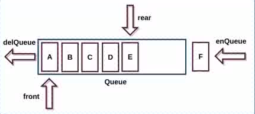
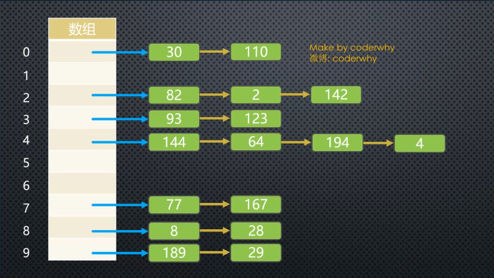
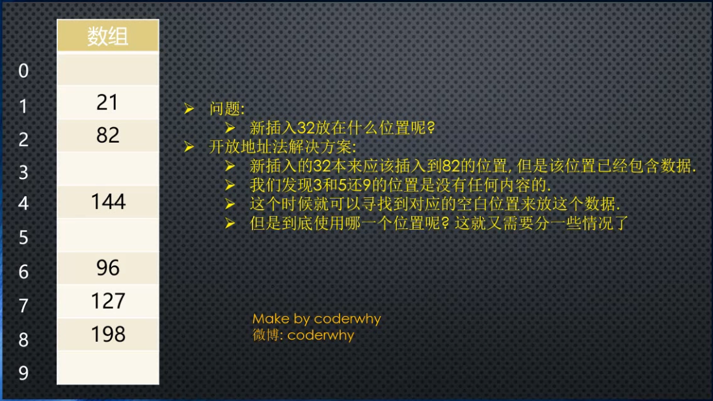
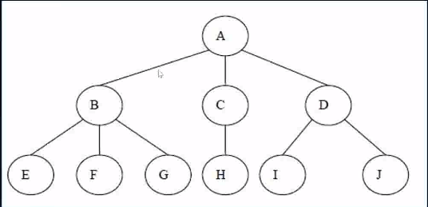
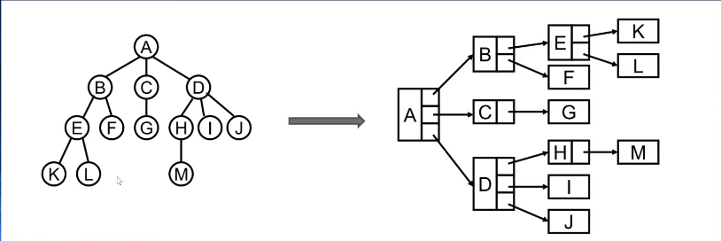
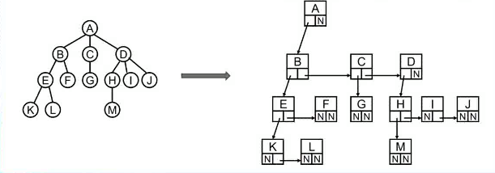
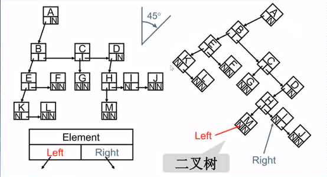
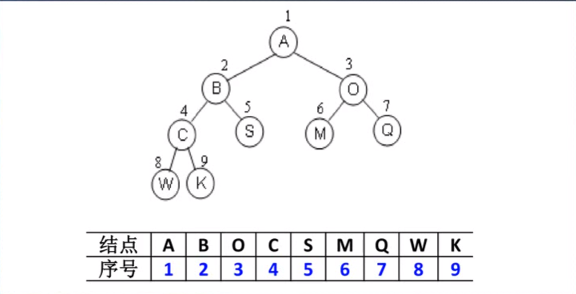
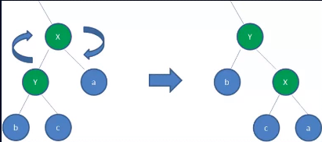

# javascript描述-数据结构与算法
## 什么是数据结构
* 在计算机中存储和组织数据的方式
### 常见的数据结构
* 数组
* 栈
* 列表
* 链表
* 图
* 散列表
* 队列
* 树
* 堆
## 什么是算法
* 有限的指令集，每个指令集不依赖于语言
* 接收一定的输入(有时也不需要输入)
* 产生输出
* 一定在有限步骤后终止
* 总结: 解决问题的方法逻辑
## 数组结构
* js的数组就是api的调用，因此略过
### 此处补充一些其他语言中的数组封装
* 常见语言的数组不能存放不同的数据类型，因此所有在封装时通常存放在数组中的是object类型
* 常见语言的数组的长度不会自动改变(需要扩容操作)
* 常见语言的数组进行中间插入和删除性能比较低
## 栈结构
* 数组是一种线性结构，并且可以在数组的任意位置插入与删除数据
* 有时候为了实现某些功能，必须对这种任意性加以限制
* 而栈和队列是比较常见的受限线性结构
### 栈结构示意图

### 栈结构特点
* 只允许在表的一端进行插入与删除操作，这一端被称为栈顶，另一端被称为栈底
* 向栈顶插入新元素被称为入栈或压栈，它是把新元素放到栈顶元素上使其称为栈顶元素
* 从栈顶删除元素被称为出栈或弹栈，它是把栈顶元素删除掉，使其相邻的元素成为新的栈顶元素
* 先进后出，后进先出 
### 栈结构的实现
* 可以通过数组或者链表实现
* 栈有以下常见操作
  * push 添加新元素到栈顶
  * pop 移除栈顶元素
  * peek 查看栈顶元素
  * isEmpty 返回布尔值
  * size    返回栈中元素数量
  * toString    将栈结构以字符串形式返回
```javascript
function Stack(){
    this.stack = []
    Stack.prototype.push = function(i){
        this.stack.push(i)
    }
    Stack.prototype.pop = function(){
        return this.stack.pop()
    }
    Stack.prototype.peek = function(){
        return this.stack[stack.length-1]
    }
    Stack.prototype.isEmpty = function(){
        return this.stack.length===0
    }
    Stack.prototype.size = function(){
        return this.stack.length
    }
    Stack.prototype.toString = function(){
        let str = this.stack.reduce((origin, current)=>{
            return origin+=current + ', '
        }, '[')
        return str.indexOf(',')>0 ? str.replace(/..$/, ']') : str.replace('[','[]')
    }
}
```
### 使用栈结构解决实际问题
* 使用栈结构完成十进制到二进制的转换
```javascript
function dec2bin(decnumber){
    let stack = new Stack()
    while(decnumber>0){
        stack.push(decnumber%2)
        decnumber = Math.floor(decnumber/2)
    }
    let bin = ''
    while(!stack.isEmpty()){
        bin += stack.pop()
    }
    return bin
}
```
## 队列结构
### 队列结构示意图

### 队列结构特点
* 也是一种受限的线性表，先进先出
* 只能在表的前端进行删除操作
* 只能在表的后端进行插入操作
### 队列结构的实现
* 与栈类似，都有数组与链表结构
* 队列中的常见方法:
  * enqueue 进入队列
  * dequeue 退出队列
  * front   显示队头
  * isEmpty 返回布尔值，是否是空队列
  * toString    将整个队列以字符串的形式展示
```javascript
function Queue(){
    this.queue = []
    Queue.prototype.enqueue = function(e){
        this.queue.push(e)
    }
    Queue.prototype.dequeue = function(){
        return this.queue.shift()
    }
    Queue.prototype.front = function(){
        return this.queue[0]
    }
    Queue.prototype.isEmpty = function(){
        return this.queue.length === 0
    }
    Queue.prototype.size = function(){
        return this.queue.length
    }
    Queue.prototype.toString = function(){
        let str = ''
        str = this.queue.reduce((origin, current)=>origin+=current+', ', '[')
        return str.indexOf(',')>0 ? str.replace(/..$/, ']') : str.replace('[','[]')
    }
}
```
#### 用队列解决一个示例
* 指定一定数量的参与者围成一个圈与一个特定数字
* 从第一位开始从1开始报数，后面报的数比前一位大一，当报的数字与给定的特定数字相同时出局
* 出局者后一位从1开始重新报数
* 直至只剩最后一位，给出最后一位的名字
```javascript
function passgame(arrList, number){
    //将参与者数组封装成一个队列
    const queue = new Queue()
    arrList.forEach(item=>queue.enqueue(item))
    //给定循环的终止条件
    while(queue.size()>1){
        //开始数数
        for(let i = 1; i < number; i++){
            queue.enqueue(queue.dequeue())
        }
        queue.dequeue()
    }
    return queue.front()
}
```
### 优先级队列
* 在优先级队列中，插入一个数据会考虑该数据的优先级
* 和其他数据的优先级进行比较
* 比较完成后才能得出这个数据在队列中的正确位置
* 每个元素不再只包含一个数据还有这个数据的优先级
* 其余规则与普通队列相同
```javascript
function PriorityQueue(){
    this.queue = []
    function Element(element, priority){
        this.element = element
        this.priority = priority
    }
    PriorityQueue.prototype.enqueue = function(name, priority){
        let element = new Element(name, priority)
        //队列空时，直接插入
        if(this.queue.length === 0){
            this.queue.push(element)
        }else{
            let added = false
            //遍历队列直到找到优先级低于当前元素然后插入那个元素之前
            for(let i = 0; i < this.queue.length; i++){
                if(element.priority < this.queue[i].priority){
                    added = true
                    this.queue.splice(i, 0, element)
                    break
                }
            }
            //遍历完数组还没有插入则直接插入最后
            if(!added){
                this.queue.push(element)
            }
        }
    }
    PriorityQueue.prototype.dequeue = function(){
        return this.queue.shift()
    }
    PriorityQueue.prototype.front = function(){
        return this.queue[0]
    }
    PriorityQueue.prototype.isEmpty = function(){
        return this.queue.length === 0
    }
    PriorityQueue.prototype.size = function(){
        return this.queue.length
    }
    PriorityQueue.prototype.toString = function(){
        let str = ''
        str = this.queue.reduce((origin, current)=>origin+=current.element+'-'+current.priority+', ', '[')
        return str.indexOf(',')>0 ? str.replace(/..$/, ']') : str.replace('[','[]')
    }
}
```
## 链表结构
### 数组常用但有许多缺点
* 创建数组需要声明一段连续的存储空间
* 数组的长度固定，要扩容需要重新申请
* 对数组头或内部操作性能耗费较多
### 链表特点
* 不必一次性申请连续空间
* 链表的每个元素由存储元素本身的节点与一个指向下一个元素的引用组成
* 访问任意一个元素需要线性查找
### 链表优点
* 可以充分利用计算机内容灵活的实现动态内存管理
* 不必在创建时就声明大小，可以无限的延伸下去
* 链表在插入和删除操作时，时间复杂度很低O(1), 相对于数组快很多
### 链表示意图

### 链表的封装
```javascript
function LinkedList(){
    //用来生成每个节点的实例
    function Node(data){
        this.data = data
        this.next = null
    }
    //创建链表头
    this.head = null
    //创建链表长度
    this.length = 0
}
```
### 链表常见操作
* append(ele) 往链表末尾插入新数据
* insert(postion,ele)   往指定位置插入新数据
* get(position) 按照指定位置获取数据
* indexOf(ele)  返回指定元素对应的位置, 如果没有此元素则返回-1
* update(position, ele) 更新指定位置的节点
* removeAt(position)    移除指定位置的节点
* remove(ele)   移除指定元素
* isEmplty()    返回布尔值判断是否·为空
* size()        返回链表长度
* toString()    //返回链表的字符串表现形式
```javascript
function LinkedList(){
    this.head = null
    this.length = 0
    function Node(data){
        this.data = data
        this.next = null
    }
    LinkedList.prototype.append = function(data){
        //创建新节点
        let newNode = new Node(data)
        //当链表没有节点时直接将头指针指向新节点
        if(length === 0){
            this.head = newNode
        }else{
            let current = this.head
            //遍历链表直到找到链表的末尾节点
            while(current.next){
                current = current.next
            }
            //将末尾节点的next指向新节点
            current.next = newNode
        }
        this.length += 1
    }
    LinkedList.prototype.insert = function(position, data){
        //边界检查，越界返回false
        if(position < 0 || position > this.length) return false
        let newNode = new Node(data)
        //如果插入第一个则直接赋值
        if(position === 0){
            this.head = newNode
        }else{
            let now = 0
            let previous = null
            let current = this.head
            //遍历链表直到找到position指向的位置然后插入
            while(now++ < position){
                previous = current
                current = current.next
                newNode.next = current
                previous.next = newNode
            }
        }
        this.length += 1
        return true
    }
    LinkedList.prototype.get = function(position){
        //边界检查，越界返回false
        if(position < 0 || position > this.length-1){
            return false
        }
        let now = 0
        let current = this.head
        //遍历链表直到找到position
        while(now++ < position){
            current = current.next
        }
        return current.data
    }
    LinkedList.prototype.indexOf = function(ele){
        let current = this.head
        let now = 0
        //遍历链表直到找到data匹配的position
        while(current){
            if(current.data === ele) return now
            current = current.next
            now++
        }
        return null
    }
    LinkedList.prototype.update = function(position, data){
        //边界检查，越界返回false
        if(position < 0 || position > this.length-1){
            return false
        }
        //遍历链表，直到找到position指向的节点
        let now = 0
        let current = this.head
        while(now++ < position){
            current = current.next
        }
        //修改匹配到的节点为指定data
        current.data = data
    }
    LinkedList.prototype.removeAt = function(position){
        //边界检查，越界返回false
        if(position < 0 || position > this.length-1){
            return false
        }
        //遍历链表，直到找到position指向的节点
        let now = 0
        let previous = null
        let current = head
        if(position === 0){
            this.head = current.next
        }else{
            while(now++ < position){
            previous = current
            current = current.next
        }
        //删除当前节点
        let output = current
            previous.next = current.next
        }
        //减小链表长度
        this.length-=1
        return output.data
    }
    LinkedList.prototype.remove = function(data){
        //遍历链表，直到找到与data匹配的节点
        let previous = null
        let current = this.head
        while(current){
            if(current.data === data){
                //判断匹配的是否是第一个节点，是则用head指向它否则进行常规操作
                previous ? (previous.next = current.next) : this.head = current.next
                //减小链表长度
                this.length-=1
                return true
            }
            previous = current
            current = current.next
        }
        return false   
    }
    LinkedList.prototype.isEmpty = function(){
        return this.length === 0
    }
    LinkedList.prototype.size = function(){
        return this.length
    }
    LinkedList.prototype.toString = function(){
        let arrlist = []
        let current = this.head
        while(current){
            arrlist.push(current.data)
            current = current.next
        }
        return arrlist.toString()
    }
}
```
### 双向链表
* 既可以从头部遍历到尾部
* 也可以从尾部遍历到头部
* 一个节点既有向前链接的引用，也有一个向后链接的引用
#### 双向链表示意图

#### 双向链表的特点
* 使用一个head与tail来分别指向链表的头部和尾部
* 每个节点由三个部分组成: 前一个节点的指针，节点数据，后一个节点的指针
* 双向链表的第一个节点的prev是null，最后一个节点的next是null
#### 双向链表的封装
* 内部封装节点类
* 内部闭包属性有指向头尾的指针
```javascript
function DoublyLinkedList(){
    
    this.head = null
    this.tail = null
    this.length = 0
    function Node(data){
        this.prev = null
        this.data = data
        this.next = null
    }
}
```
#### 双向链表的实现
```javascript
function DoublyLinkedList(){
    this.head = null
    this.tail = null
    this.length = 0
    function Node(data){
        this.prev = null
        this.data = data
        this.next = null
    }
    DoublyLinkedList.prototype.append = function(data){
        let newNode = new Node(data)
        //如果链表为空，则将头指针指向新节点
        if(this.length === 0){
            this.head = newNode
        }else{
        //如果链表不为空，则将尾节点的next指向新节点，新节点的prev指向尾节点
            this.tail.next = newNode
            newNode.prev = this.tail
        }
        //将尾指针指向新尾节点
        this.tail = newNode
        this.length++
    }
    DoublyLinkedList.prototype.insert = function(position, data){
        let newNode = new Node(data)
        //越界判断
        if(position < 0 || position >= this.length) return false
        //当链表为空时首尾指针都指向新节点
        if(length === 0){
            this.head = newNode
            this.tail = newNode
        }else{
            //当向第一个位置插入新节点时，只修改头指针与后一个节点
            if(position === 0 ){
                this.head.prev = newNode
                newNode.next = this.head
                this.head = newNode
                //当向最后位置插入新节点时，只修改尾指针与前一个节点
            }else if(position === this.length){
                this.tail.next = newNode
                newNode.prev = this.tail
                this.tail = newNode
            }else{
                //普通情况下修改前后节点的prev与next指针
                let index = 0
                let current = this.head
                while(index++ < position){
                    current = current.next
                }
                current.prev.next = newNode
                newNode.prev = current.prev
                newNode.next = current
                current.prev = newNode
            }
        }
        //插入结束，长度加一
        this.length++
        return true
    }
    DoublyLinkedList.prototype.get = function(position){
        //越界判断
        if(position < 0 || position > this.length) return null
        //当position位于链表前半段时正向遍历，否则反向遍历
        let current = this.head
        let index = 0
        if(position <= this.length/2){
            while(index++ < position){
                current = current.next
            }
        }else{
            current = this.tail
            index = this.length - 1
            while(index-- > position){
                current = current.prev
            }
        }
        return current.data
    }
    DoublyLinkedList.prototype.indexOf = function(data){
        let current = this.head
        let index = 0
        //遍历链表直到找到数据相等的那一个节点
        while(current){
            if(current.data === data)   return index
            index++
            current = current.next
        }
        //整个链表未找到数据相等的则返回-1
        return -1
    }
    DoublyLinkedList.prototype.update = function(position, data){
        let index = 0
        let current = this.head
        //根据position位于链表前半段还是后半段来决定正向还是反向查找
        if(position < index/2){
            while(index++ < position){
                current = current.next
            }
        }else{
            index = this.length-1
            current = this.tail
            while(index-- > position){
                current = current.prev
            }
        }
        //将查找到的节点重新赋值
        current.data = data
    }
    DoublyLinkedList.prototype.removeAt = function(position){
        //越界判断
        if(position < 0 || position > this.length) return false
        //当链表只有一个节点时，首尾指针置空
        let output = null
        if(this.length === 1){
            output = this.head
            this.head = null
            this.tail = null
        }else{
            //当删除的是第一个节点时，需要改变头指针与后一个节点
            if(position === 0){
                output = this.head
                this.head.next.prev = null
                this.head = this.head.next
                //当删除的是最后一个节点时，需要改变尾指针与前一个节点
            }else if(position === this.length-1){
                output = this.tail
                this.tail.prev.next = null
                this.tail = this.tail.prev
                //常规情况，前后两个节点都要修改
            }else{
                let current = this.head
                let index = 0
                //判断position是在链表前半段还是后半段并就近遍历到指定位置
                if(position < index/2){
                    while(index++ < position){
                        current = current.next
                    }
                }else{
                    current = this.tail
                    index = length - 1
                    while(index-- > position){
                        current = current.prev
                    }
                }
                output = current
                //修改前后节点
                let prev = current.prev
                let after = current.next
                prev.next = after
                after.prev = prev
            }
        }
        //方法结束链表总长度减一
        this.length--
        return output.data
    }
    DoublyLinkedList.prototype.remove = function(data){
        return this.removeAt(this.indexOf(data))
    }
    DoublyLinkedList.prototype.size = function(){
        return this.length
    }
    DoublyLinkedList.prototype.isEmpty = function(){
        return this.length===0
    }
    DoublyLinkedList.prototype.toString = function(){
        let arrlist = []
        let current = this.head
        while(current){
            arrlist.push(current.data)
            current = current.next
        }
        return arrlist
    }
    DoublyLinkedList.prototype.forwardString = function(){
        let arrlist = []
        let current = this.head
        while(current){
            arrlist.push(current.data)
            current = current.next
        }
        return arrlist
    }
    DoublyLinkedList.prototype.backwardString = function(){
        let arrlist = []
        let current = this.tail
        while(current){
            arrlist.push(current.data)
            current = current.prev
        }
        return arrlist
    }
}
```
## 集合
* 集合是由无序，不能重复的元素构成
* 本质是特殊的数组，但是不能通过下标访问，相同的对象也只能保存一份
### 封装集合
* 由于要保证相同的对象只能保存一份因此使用对象来实现
* Object.keys返回值就是一个集合
```javascript
function Set(){
    this.item = {}
}
```
### 实现集合
* 集合有一些常用方法:
  * add(data)   添加新元素
  * delete(data)    删除元素
  * has(data)   判断是否存在data
  * clear()     清除整个集合
  * size()  返回元素数量
  * values()    返回包含所有元素的数组
```javascript
function Set(){
    this.item = {}
    Set.prototype.add = function(data){
        this.item[data] = data
    }
    Set.prototype.delete = function(data){
        delete this.item[data]
    }
    Set.prototype.has = function(data){
        return this.item.hasOwnProperty(data)
    }
    Set.prototype.clear = function(){
        this.item = {}
    }
    Set.prototype.size = function(){
        return Object.keys(this.item).length
    }
    Set.prototype.values = function(){
        return Object.keys(this.item)
    }
}
```
### 集合间操作
* 并集: 对于给定的两个集合，返回一个包含两个集合所有元素的集合
* 交集: 对于给定的两个集合，返回一个包含两个集合共同拥有元素的集合
* 差集: 对于给定的两个集合，返回一个包含出现于第一个集合的元素但没有出现在第二个集合中的元素
* 子集: 验证一个给定集合是不是另一个集合的子集
```javascript
//union
Set.prototype.union = function(setB){
    let unionSet = new Set()
    let arrA = this.values()
    let arrB = setB.values()
    arrA.forEach(e=>unionSet.add(e))
    arrB.forEach(e=>unionSet.add(e))
    return unionSet
}
//intersection
Set.prototype.intersection = function(setB){
    let intersectionSet = new Set()
    let arrA = this.values()
    arrA.forEach(e=>{
        if(setB.has(e)) intersectionSet.add(e)
    })
    return intersectionSet
}
//difference
Set.prototype.difference = function(setB){
    let differenceSet = new Set()
    let arrA = this.values()
    arrA.forEach(e=>{
        if(!setB.has(e)) differenceSet.add(e)
    })
    return differenceSet
}
//subset
Set.prototype.subset = function(setB){
    let differenceSet = new Set()
    let arrA = this.values()
    let isSub = true
    arrA.forEach(e=>{
        if(!setB.has(e)) isSub = false
    })
    return isSub
}
```
## 字典
* 数组-集合-字典是编程语言几乎都是带有的数据类型
* 主要特点是一一对应的关系，key-value
* 字典中的key是不可重复并且无序的，但是value是可以重复的
* 字典也可以通过对象与哈希表来实现
* js中的对象与字典很相似，因此不再使用对象来从底层封装实现
### 字典与映射
* 本质是相同的
* 有些编程语言中也将字典称为映射
### 字典与数组
* 字典与数组区别在于查找字典是通过key来实现的，更具有语义化
### 字典与对象
* 在有些语言中字典与对象有比较明显的不同，对象在编译前结构已经确定不可以动态的添加与删除元素，而字典通常是使用哈希表的结构来实现的，可以动态删除与添加元素
* 在js中似乎对象与字典是一样的，因此一开始js没有封装字典这种数据类型，所以完全可以使用对象来代替
## 哈希表
* 它可以提供非常快的增加，删除，查找操作
* 无论多少数据，插入和删除值都是接近常量的时间，即O(1)的时间级
* 速度甚至快于树
* 相对于树编码也简单
* 数据没有顺序，遍历效率比较低
* 数据不能重复
### 字符转数字的方案
#### 字符集
* ASCII: 包括了英文中的所有字符
* ISO-xxxx: 包括了西方的所有字符，根据`-`后面的数字不同也会有一些差异
* GBXXXX: 含有中文的字符集，有GB2312, GBK, GB18030等，包含的汉字依次增多
* unicode: 包括了所有文字的字符集, 有UTF-32, UTF-16, UTF-8等，其中UTF-8是可变字符集
#### 单词转数字
* 存在两种方案
##### 将每个字符的编码相加
* 例如$abc=97+98+99$
* 不同的单词产生的最终结果会发生重复
##### 将每个字符的编码按幂乘相加
* 例如$abc=97\times256^2+98\times256^1+99\times256^0$
* 用来保存结果的数组会过大，且其中有许多空间保存的都是没有意义的单词
##### 哈希化
* 通过取余操作将大数字压缩到小数字
* 但是这种操作会造成重复
* 一般将哈希化后的结果称为hashCode
### 哈希表的概念
* 将大数字转化成较小范围内数字下标的过程叫做哈希化
* 通常会将单词转化成一个大数字，大数字通过哈希化转换成hashCode的过程会封装到一个函数中，这个函数被称为哈希函数
* 最终将数据插入到一个数组中，对整个结构进行封装，就称其为哈希表
### 冲突
* 当通过哈希函数取得一个hashCode时，很有可能这个值的下标所处的位置上已经存放过数据了
* 当发生上述情况时则成为产生了冲突
* 虽然产生冲突的可能性非常小，但是仍旧需要去解决它
* 通常有两种方案来解决这种冲突，分别是:
  1. 链地址法
  2. 开放地址法
#### 链地址法
* hashCode所对应的下标不再是单一数字，而是保存的一个数组或者链表
* 一般来说产生的冲突可能很小所以数组和链表的效率相似
* 在有些业务中新产生的数据被查找的可能性更大因此需要插入到表头则使用链表是效率更高
* 其他情况两种数据结构都是可行的
* 链地址法示意图:

#### 开放地址法
* 将冲突的数据移动到仍然是空白的空间中
* 根据移动步长的区别也有不同的方法来实现开放地址法
* 开放地址法示意图:

##### 线性探测
* 将步长固定为1，每当发生冲突则自动向后查找空白空间直到找到然后插入
* 通过这种方法实现的话在查找元素时需要注意两个问题
  1. 在向后查找元素的过程中，遇到null就要停止查找，返回false
  2. 在删除数据时不能置为null，使用其他表示空的内容代替，如-1，否则可能会因第一条规则导致数据永远也无法被找到
* 在插入数据时经常会遇到聚集的问题，即一次性插入一连串数据，这些数据是相邻排列的
* 此时通过线性探测来存放数据就每次都需要跳过一连串空间，会造成性能的降低
##### 二次探测
* 以线性探测中步长的平方来充当步长，即1, 4, 9, 16...
* 查找规则与线性探测类似
* 虽然可能性很低但当许多数据都想插入同一个位置时，就会在查找时需要跳过这一连串的距离
* 同样这种情况会造成性能的降低
##### 再哈希
* 将产生冲突的数据通过另一个哈希函数来决定步长，从而插入指定位置
* 这种方式寻找的新空间一般不会再产生冲突
* 有一种经过验证效果非常好的哈希函数来解决这个问题:
  * $step=constant-(key-constant)$
  * 其中constant是常量, key是大数字
### 比较链地址法与开放地址法的效率
* 在比较效率前需要通过一个称为装填因子的数来判断哈希表中已有数据量的大小
* $装填因子=总数据项\div表长$
* 通过计算机专家的测试，开放地址法的平均解决冲突所需要探测的次数按指数上升
* 通常二次探测与再哈希效率相似，且两者都比线性探测高
* 链地址法平均解决冲突所需要探测的次数是线性上升
* 因此为了保证哈希表不因为插入了某个数据而造成性能急剧下降，通常都会使用链地址法来解决冲突问题
### 优秀的哈希函数
* 优秀的哈希函数需要尽可能解决以下两个问题:
  1. 计算效率
  2. 散布的均匀程度
#### 计算效率
* 在减少计算的效率的过程中需要尽可能减少乘除在运算中出现的次数
* 回顾字符转数字那一节中的内容，可以发现在进行幂乘运算的过程乘法的时间复杂度为O(n<sup>2</sup>)
* 通过霍纳法则(秦九韶算法)可以减少多项式中乘法的次数，将原本的算法变成:
  * $abc=(((97)\times256+98)\times256+99)$
* 此时乘法的时间复杂度就变成了O(n)，可以提升许多性能
#### 散布的均匀程度
* 为了实现这一目标通常会将函数中所有的常数都是用质数来代替
* 通常幂乘的常量置为37
* 详细原理不深入讨论，但这种方案结果可以让整个哈希表在解决冲突的过程中尽可能被遍历，同时也能减少遍历的次数
* 但在某些应用比如java实现maplist不是通过取余数而是通过将key与表长减一的值进行位与操作来得到hashCode
### 哈希函数的实现
```javascript
function HashTable(){
    //哈希表总长
    this.limit = 7
    //表中数据量
    this.total = 0
    //哈希表数组
    this.item = []
    //哈希函数
    HashTable.prototype.hashFunc = function(key, limit){
        //使用unicode编码的幂乘相加计算原始下标，幂乘计算使用霍纳法则简化
        let keyvalue = 0
        for(let i=0; i<key.length; i++){
            keyvalue=keyvalue * 37 + key.charCodeAt(i)
        }
        //使用取余运算计算hashCode
        return keyvalue%limit
    }
    HashTable.prototype.put = function(key, value){
        //根据hashCode找到对应下标的basket修改或者添加数据，此处使用数组实现
        let index = this.hashFunc(key, this.limit)
        let arr = this.item[index]
        if(arr){
            //如果basket有内容则按照链地址法
            let completed = false
            //遍历数组，如果发现重名数据则直接修改
            arr.forEach(item=>{
                if(key===item[0]){
                    completed = true
                    return item[1] = value
                }
            })
            //如果没有重名数据则向数组末尾添加新数据
            if(completed){
                arr.push([key, value])
                this.total++
        }else{
            //如果basket为null则重新创建数组
            this.item[index] = [[key, value]]
            this.total++
        }
    }
    HashTable.prototype.get = function(key){
        let index = this.hashFunc(key, this.limit)
        let basket = this.item[index]
        //如果basket为null则没有对应数据
        if(basket===undefined){
            return null
        }else{
            //如果有basket, 则遍历basket，遍历完没有对应key则不存在对应数据
            for(let i = 0; i < basket.length; i++){
                if(key===basket[i][0]) return basket[i][1]
            }
            return null
        }
    }
    HashTable.prototype.remove = function(key){
        let index = this.hashFunc(key, this.limit)
        let basket = this.item[index]
        //如果basket为null则没有对应数据
        if(!basket){
            return null
        }else{
            //如果有basket, 则遍历basket，遍历完没有对应key则不存在对应数据
            for(let i = 0; i < basket.length; i++){
                if(key===basket[i][0]){
                    this.total--
                    return basket.splice(i, 1)
                }
            }
            return null
        }
    }
    HashTable.prototype.size = function(){
        return this.total
    }
    HashTable.prototype.isEmpty = function(){
        return this.total===0
    }
}
```
### 哈希表的扩容/减容
* 装载因子增加时无论链地址法还是开放地址法，它们的性能都会下降
* 当装载因子大于一定的值时(通常是0.75)有必要对整个哈希表进行扩容
* 当装载因子小于一定的值时(通常是0.25)有必要对整个哈希表进行减容
* 扩容时需要取出所有哈希表中保存的数据并按照根据新表长度计算出的hashCode来存放数据
* 虽然这种操作比较消耗性能，但是为了整体性能考虑，还是有必要进行扩容操作
* 由于为了保证扩容后的表长仍旧为质数，需要实现一个判断值是否为质数的函数
```javascript
//判断是否属于质数的函数
HashTable.prototype.isPrime = function(num){
    num = Math.floor(num)
    //从3开始判断，因为1，2不是质数
        if(num>2){
            //从2开始遍历到比num开根号的数，如果能被其中的数整除则为质数
            for(let i=2; i<Math.sqrt(num); i++){
                if(num%i===0) return false
            }
            return true
        }
        return false
    }
//哈希表扩容函数
HashTable.prototype.resize = function(size){
    //创建变量保存老哈希表数组并重新创建数组给哈希表用来重新保存原数据
    let oldItem = this.item
    this.item = []
    //重新设置哈希表长度，寻找离size最近的素数
    this.total = 0
    let prime = size
    while(!this.isPrime(prime)){
        prime++
    }
    //将哈希表长度设置为这个素数
    this.limit = prime
    //遍历哈希表数组，当遇到basket为null时跳过，不是时进入basket
    for(let i=0; i<this.limit; i++){
        let basket = oldItem[i]
        if(basket==null) continue
        basket.forEach(item=>{
            this.put(item[0], item[1])
        })
    }
}
//重写put, remove函数，增加自动扩容减容功能
HashTable.prototype.put = function(key, value){
    //根据hashCode找到对应下标的basket修改或者添加数据，此处使用数组实现
    let index = this.hashFunc(key, this.limit)
    let arr = this.item[index]
    if(arr){
        //如果basket有内容则按照链地址法
        let completed = false
        //遍历数组，如果发现重名数据则直接修改
        arr.forEach(item=>{
            if(key===item[0]){
                completed = true
                return item[1] = value
            }
        })
        //如果没有重名数据则向数组末尾添加新数据
        if(completed){
            arr.push([key, value])
            this.total++
            //如果超出0.75的重载因子则扩容
            if(this.total > this.limit*0.75){
                this.resize(this.limit*2)
            }
        }
    }else{
        //如果basket为null则重新创建数组
        this.item[index] = [[key, value]]
        this.total++
        //如果超出0.75的重载因子则扩容
            if(this.total > this.limit*0.75){
                this.resize(this.limit*2)
            }
    }
}
HashTable.prototype.remove = function(key){
    let index = this.hashFunc(key, this.limit)
    let basket = this.item[index]
    //如果basket为null则没有对应数据
    if(!basket){
        return null
    }else{
        //如果有basket, 则遍历basket，遍历完没有对应key则不存在对应数据
        for(let i = 0; i < basket.length; i++){
            if(key===basket[i][0]){
                this.total--
                let output = basket.splice(i, 1)
                //如果低于0.25的重载因子则减容,但总长度不能小于7
                if(this.limit > 7 && this.total < this.limit*0.25){
                    this.size(this.limit/2)
                }
                return output
            }
        }
        return null
    }
}
```
## 树结构
* 由一个根节点开头，不断向下细分节点的一种结构
### 树结构的抽象

### 树结构的优点
* 树结构并非就是好过其他所有数据结构，因为每种数据结构都自己适合的应用场景
* 但是的确综合了其他数据结构的一些优点，例如增删改快于数组链表，遍历快于哈希表等
* 为了模拟一些应用场景使用树结构更加方便，因为树结构能够表示一对多的关系
* 例如文件结构等
### 树结构的表示
* 将一个树以数据结构的形式表现是有两种形式: 普通表示法，儿子兄弟表示法
#### 普通表示法示意图

#### 儿子兄弟表示法示意图

* 通过将图旋转45度可以发现父节点无论有多少个子节点都可以在数据结构上表现成只有两个节点的树,即二叉树
* 因此二叉树在树结构中是非常重要的一种形式

### 二叉树
* 树中的每个节点最多只能有两个子节点，这样的树就成了二叉树
* 二叉树可以为空，也就是没有任何节点
* 若不为空，则它是由根节点和称为其左子树TL与右子树TR的两个不相交的二叉树组成
#### 二叉树特性
* 第n层的节点个数最多为: $2^{n-1}, n\geq1$
* 深度为k的二叉树总节点数最多为: $2^k-1, k\geq1$
* 对于任何非空二叉树，叶节点树n<sub>0</sub>与度为2的父节点n<sub>2</sub>之间有如下关系: $n_0=n_2+1$
#### 完美二叉树(满二叉树)
* 在二叉树中，除了最下一层的叶节点外每层节点都有2个子节点，就构成了满二叉树
#### 完全二叉树
* 除二叉树最后一层外所有节点度都为2
* 最后一层从左向右的叶节点连续存在
* 完美二叉树是完全二叉树的特殊形式
#### 二叉树的表示方式
* 二叉树存储的常见形式有数组与链表
##### 数组表示
* 使用数组保存完全二叉树时比较方便，因为将完全二叉树按从上到下从左到右的顺序存放时，需要查找的节点的索引与父节点非常相关
* 父节点索引为$n$，若这个节点是父节点的左节点则索引为$2n$, 若是右节点则索引为$2n+1$
* 但是当不是完全二叉树时只能通过填补没有节点的位置强行构成完全二叉树来满足以上规则
* 此时会浪费许多空间，因为很多索引是没有数据的

##### 链表表示
* 可以用来表示任何结构的树且不会造成内存浪费，是常用的来表示树的结构

### 二叉搜索树(BST binary search tree)
* 二叉树的特殊形式，满足以下性质: 
  * 非空左子树的键值要小于根节点的键值
  * 非空右子树的键值要大于根节点的键值
  * 左右子树本身也是二叉搜索树
* 这种树的查找效率很高，蕴含了二分查找的思想
#### 二叉搜索树的封装
```javascript
function BinarySearchTree(){
    //使用根变量来指向根节点
    this.root = null
    //封装一个节点，里面有key，左子树指针，右子树指针
    function Node(key){
        this.key = key
        this.left = null
        this.right = null
    }
}
```
#### 二叉搜索树的实现
* 二叉搜索树有以下常见操作:
  * insert(key) 向树中插入新节点
  * search(key) 查找指定节点
  * inOrderTraversal()   中序遍历树
  * preOrderTraversal()  先序遍历树
  * postOrderTraversal() 后序遍历树
  * min()   获取树中的最大值
  * max()   获取树中的最小值
  * remove(key) 移除指定节点
* 前驱与后继
  * 当删除度为2的节点时有两个重要概念前驱与后继
  * 前驱意思是在整个树中键值大小与目标节点最相近的小于目标节点的那个节点
  * 后继意思是在整个树中键值大小与目标节点最相近的大于目标节点的那个节点
  * 在删除度为2的节点时，本质就是寻找目标节点的前驱或者后继来代替原位置
```javascript
function BinarySearchTree(){
    //使用根变量来指向根节点
    this.root = null
    //封装一个节点，里面有key，左子树指针，右子树指针
    function Node(key){
        this.key = key
        this.left = null
        this.right = null
    }
    BinarySearchTree.prototype.insert = function(key){
        let newNode = new Node(key)
        //判断根节点是否为空，空则直接插入
        if(this.root === null){
            this.root = newNode
        }else{
            //不为空则执行递归函数来将新节点插入相应位置
            this.insertNode(this.root, newNode)
        }
    }
    BinarySearchTree.prototype.insertNode = function(root, newNode){
        //当root存在时继续递归
        if(root !== null){
            //当新节点的值大于当前树根节点时
            if(newNode.key > root.key){
                //如果树根节点有右子树时，将右子树当做新树根节点传入
                if(root.right !== null){
                    this.insertNode(root.right, newNode)
                }else{
                    //如果树根节点的右子树不存在时，将新节点存放于右节点上
                    root.right = newNode
                }
            }else{
                //当新节点的值小于当前树根节点时
                if(root.left !== null){
                    //如果树根节点有左子树时，将左子树当做新树根节点传入
                    this.insertNode(root.left, newNode)
                }else{
                    //如果树根节点的左子树不存在时，将新节点存放于左节点上
                    root.left = newNode
                }
            }
        }
    }
    BinarySearchTree.prototype.search = function(key){
        //如果根节点不存在直接返回null
        if(this.root === null){
            return false
        }else{
            //如果存在就遍历整棵树
            let current = this.root
            //current不存在则跳出循环
            while(current !== null){
                //遇到键值匹配则存在此数据
                if(current.key === key) return true
                //当查找的键值小于当前节点的键值则向节点的左边查找否则向右查找
                current = current[key < current.key ? 'left': 'right']
            }
            //如果循环到了树的最深层都没有相应键值则证明不存在这个值
            return false
        }
    }
    BinarySearchTree.prototype.inOrderTraversal = function(){
        let arr = []
        //如果根节点不存在则直接返回
        if(this.root === null) return arr
        //如果根节点存在则递归遍历树
        this.traversalNode('in', this.root, item=>{
            arr.push(item)
        })
        return arr
    }
    BinarySearchTree.prototype.preOrderTraversal = function(){
        let arr = []
        //如果根节点不存在则直接返回
        if(this.root === null) return arr
        //如果根节点存在则递归遍历树
        this.traversalNode('pre', this.root, item=>{
            arr.push(item)
        })
        return arr
    }
    BinarySearchTree.prototype.postOrderTraversal = function(){
        let arr = []
        //如果根节点不存在则直接返回
        if(this.root === null) return arr
        //如果根节点存在则递归遍历树
        this.traversalNode('post', this.root, item=>{
            arr.push(item)
        })
        return arr
    }
    BinarySearchTree.prototype.traversalNode = function(order, root, callback){
        //root存在才继续执行递归
        if(root !== null){
            //中序遍历
            if(order === 'in'){
                //从当前节点的左子树开始继续遍历
                this.traversalNode(order, root.left, callback)
                //已经从左子树处跳回的那个节点对节点的key进行处理
                callback(root.key)
                //从当前节点的右子树开始遍历
                this.traversalNode(order, root.right, callback)
            //前序遍历
            }else if(order === 'pre'){
                //先对当前节点进行操作
                callback(root.key)
                //从当前节点的左子树开始继续递归遍历
                this.traversalNode(order, root.left, callback)
                //从当前节点的右子树开始继续递归遍历
                this.traversalNode(order, root.right, callback)
            //后序遍历
            }else if(order === 'post'){
                //从当前节点的左子树开始继续递归遍历
                this.traversalNode(order, root.left, callback)
                //从当前节点的右子树开始继续递归遍历
                this.traversalNode(order, root.right, callback)
                //对当前节点进行操作
                callback(root.key)
            }
        }
    }
    BinarySearchTree.prototype.min = function(){
        //二叉搜索树特点中整个树最左边的节点是最小值
        let current = this.root
        while(current.left !== null){
            current = current.left
        }
        return current.key
    }
    BinarySearchTree.prototype.max = function(){
        //整个树最右边的节点是最大值
        let current = this.root
        while(current.right !== null){
            current = current.right
        }
        return current.key
    }
    //移除二叉搜索树中的任意节点，此方法难度较高，将几种移除的可能性提前列出
    //  1.移除的节点是叶子节点，即度为0时
    //  2.移除的节点只有一个子节点，即度为1时
    //  3.溢出的节点有两个子节点，即度为2时
    //每种情况下也有多种情形，详细步骤在代码中讨论
    BinarySearchTree.prototype.remove = function(key){
        //初始化需要使用到的变量
        let parrent = null
        let current = this.root
        let isLeftChild = true
        //遍历二叉树直到找到目标节点
        while(current !== null){
            if(key = current.key) break
            //当目标键值小于当前节点键值时向左子树继续查找
            if(key < current.key){
                parrent = current
                current = current.left
                isLeftChild = true
            }else{
                parrent = current
                current = current.right
                isLeftChild = false
            }
        }
        //当current不是空时则找到了目标节点
        if(current !== null){
            //此时目标节点会分成3种情况，进行分别讨论
            //情况一，度为0
            if(current.left === null && current.right === null){
                //当根节点的键值满足时直接删除
                if(current.key === this.root.key){
                    this.root = null
                }else{
                //不是根节点时就是叶子节点，直接删除
                //根据目标节点是父节点的左子树还是右子树来决定清空父节点的哪个指针
                    parrent[isLeftChild ? 'left' : 'right'] = null
                    }
                    //当目标节点度为2的情况，此处使用前驱来代替目标节点
            }else if(current.left !== null && current.right !== null){
                //当前节点为根节点时，直接将前驱当做根节点
                if(current.key === this.root.key){
                        const preNode = this.findPre(current)
                        preNode.left = current.left
                        preNode.right = current.right
                        this.root = preNode
                    }else{
                        //当前节点不为根节点时
                        //根据目标节点是父节点的左子树还是右子树来决定父节点的哪个指针指向前驱节点
                        const preNode = this.findPre(current)
                        preNode.left = current.left
                        preNode.right = current.right
                        parrent[isLeftChild ? 'left' : 'right'] = preNode
                    }
                }else{
                    //当目标节点度为1的情况
                    //当current为根节点时直接将根节点指针指向current的子节点
                    if(current.key === this.root.key){
                        this.root = current.left || current.right
                    }else{
                        //current不是根节点时将current的子节点代替current的位置
                        const childNode = current.left || current.right
                        parrent[isLeftChild ? 'left' : 'right'] = childNode
                    }
                }
                return current.key
            }else{
            //当current为空时则说明没有对应目标节点，返回false
            return false
        }
    }
    //返回一个传入参数的前驱节点的函数
    BinarySearchTree.prototype.findPre = function(root){
        let current = root.left
        let preParrent = root
        //循环直到搜索到根节点的前驱节点
        while(current.right !== null){
            preParrent = current
            current = current.right
        }
        //前驱节点还有左子树时
        if(current.left !== null){
            //如果是根节点的左子树则将前驱节点的左子树赋值给根节点的左子树
            //如果不是则用前驱节点的左子树赋值给前驱节点的父节点的右子树
            preParrent[current === root.left ? 'left' : 'right'] = current.left
        }else{
        //没有左子树则直接置空前驱节点的原位置
            //如果是根节点的左子树则清空左子树
            //如果不是则清空父节点的右子树
            preParrent[current === root.left ? 'left' : 'right'] = null
        }
        //返回前驱节点
        return current
    }
}
```
#### 二叉搜索树的缺陷
* 二叉搜索树由于查找效率与树的深度有关，因此深度也就决定了查找的效率
* 当连续插入的数据是有序时，在二叉搜索树的规则下，会在数据量不大时仍然生成深度比较高的树
* 甚至在极端情形下会演变成链表，时间复杂度由O(logn)转变成O(n)
* 这种左子树数量与右子树数量严重不相同的情形被称为非平衡树，近似相同称为平衡树
* 由于平衡树的效率要远高于非平衡树，因此有许多算法会尝试将非平衡树转变成平衡树
* 常见的算法包括: AVL树, 红黑树
* 其中红黑树在添加删除元素时效率高于AVL树，因此后者非常少见了
### 红黑树
* 红黑树除了满足二叉搜索树的规则之外还有一些额外的性质:
  1. 所有节点都是红色或者黑色的
  2. 根节点是黑色的
  3. 没有左右子节点的节点必须用黑色的空节点补齐(NIL节点)
  4. 每个红色节点的两个子节点都是黑色的(从每个叶子节点到根的路径上不会出现连续的红色节点)
  5. 从任一节点到任意叶子节点之间包含的黑色节点数量是相同的
* 根据以上性质能够确保一个关键特性:
  * 从根到叶子的最长路径不会超过最短路径的两倍
  * 限制了最长路径与最短路径的比例也就保证了这棵树是基本平衡的
  * 虽然没有做到绝对平衡，但是可以保证在最坏的情况下依然是高效的
* 由性质推导到特性的过程
  * 由性质四可知一条路径不能有连续的红色节点
  * 最短路径肯定是只有黑色节点
  * 最长路径肯定是红黑节点都有
  * 一条路径的起点与终点必定是黑色节点，由性质五即可知最长路径必定小于最短路径的两倍
### 红黑树的变化
* 当给红黑树插入新节点时很可能就不满足红黑树的规则，因此需要让红黑树发生三种变换来使其再次满足规则
* 变色，坐旋转，有旋转
#### 变色
* 当颜色不再满足规则时需要将红色节点变成黑色节点
* 通常新插入的节点都是红色的。有两种原因:
  1. 当插入位置是一个黑色节点的子节点时，插入的红色节点可以直接替换黑色节点的NIL节点
  2. 根据性质4，如果插入节点黑色的则必定会使所有路径都要增加一个黑色节点
  3. 为了尽可能减少操作量所有设定所有新插入的节点为红色
#### 左右旋转
* 左旋转为逆时针旋转，右旋转为顺时针旋转
#### 左右旋转示意图


#### 左旋转规则
* 让根节点成为根节点右子树的左子树，让涉及到的另外两个子树互相交换位置
* 步骤:
  1. 以X作为根节点，将X设置为X的右子节点Y的左子节点b
  2. 让b成为X的右子节点
  3. 让Y成为根节点
* 右旋转类似，让根节点成为根节点的左子树的右子树
### 红黑树的插入规则
* 将变化情况进行分类可以得出插入新节点后的操作可以分成五种情况
* 设新节点为n, 父节点为p, 父节点的兄弟节点为u, 祖父节点为g
#### 情况一
* n是根节点时
  1. 将n变成黑色
#### 情况二
* p为黑色时不需要进行其他变换
#### 情况三
* p为红色且u也为红色时
  1. 将p与u变成黑色, 将g变为红色
  2. 将g当做新插入节点，递归进行重新判断
#### 情况四
* p为红色，u为黑色且n是p的左节点时
  1. 将p变为黑色, 将g变为红色
  2. 以g为根节点进行右旋转
  3. 将p当做新插入节点，递归进行重新判断
#### 情况五
* p为红色，u为黑色且n是p的右节点时
  1. 以p为根节点进行左旋转变成情况四
  2. 以g为根节点进行右旋转
  3. 将p当做新插入节点，进行递归重新判断
### 关于红黑树的删除问题
* 二叉搜索树的删除操作比较
* 红黑树的插入操作也比较复杂
* 红黑树的删除操作是将二叉搜索树的删除操作与红黑树的插入操作进行结合难度非常高
* 具体步骤过于繁杂但是基于一个思想仍然可以考虑清楚，即在每种删除情况中考虑被删节点的颜色即可